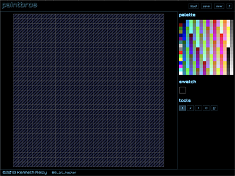

# paintbros
Simple old-school paint program

## Introduction
This is a simple project I threw together to create raster graphics in custom formats for an experimental game engine I was working on. I never did finish the 2D game engine, but this turned out to be a cool enough project anyway.

## Getting Started
Fork and/or clone this repo to get started. You'll need [Node](https://nodejs.org) and [TypeScript](https://typescriptlang.org) to build this project.

To compile this project, simply run `tsc` from within the project folder.

I hope you enjoy this cool retro paint program!

Kenneth [@8_bit_hacker](https://twitter.com/8_bit_hacker)
